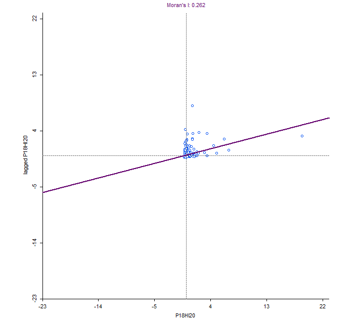
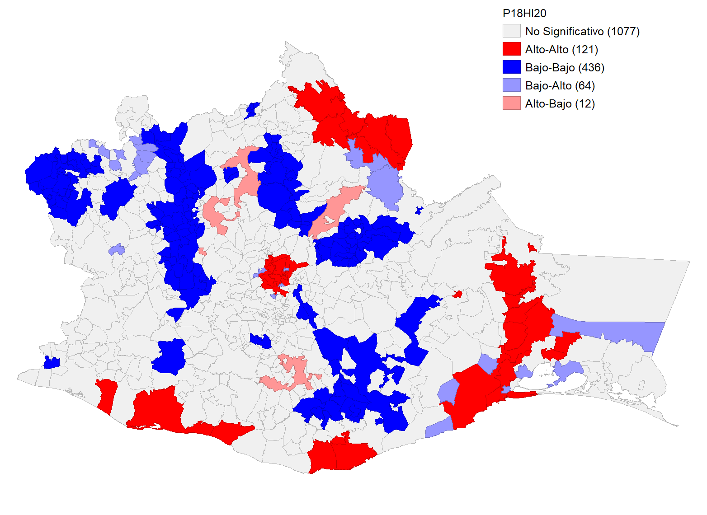
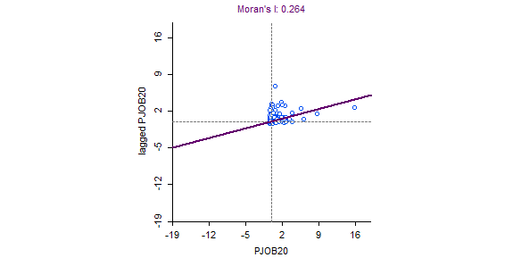
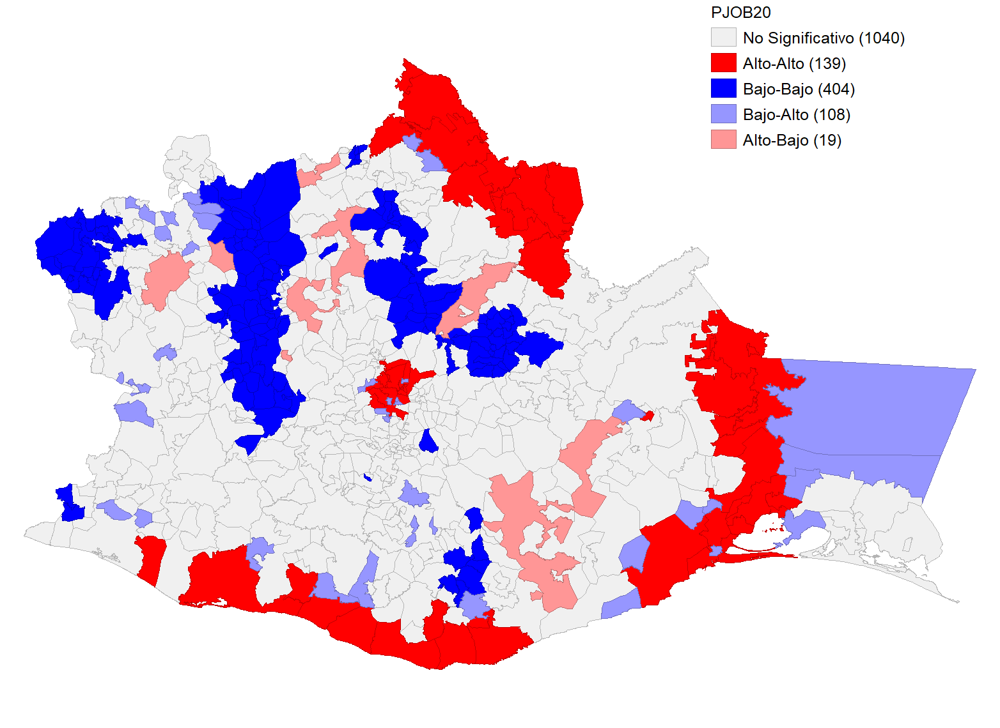

### **Abstract**

Este análisis espacial explora la hipótesis de que el nivel educativo de
un municipio influye positivamente en el nivel educativo y el desarrollo
económico de sus municipios vecinos, generando un efecto de contagio
educativo a través de la proximidad geográfica. Investigaciones previas
han identificado la existencia de "spillovers" o derrames espaciales
educativos y económicos entre regiones cercanas.

Un ejemplo notable es el estudio realizado en China por Zhang et al.
([ScienceDirect](https://www.sciencedirect.com/science/article/abs/pii/S0166046215001118?via%3Dihub)),
que demuestra que el gasto en educación superior no solo beneficia
directamente a la región receptora, sino que sus efectos positivos se
extienden a las áreas circundantes. En este trabajo, utilizamos datos
municipales de Oaxaca, México, y aplicamos técnicas de análisis espacial
para probar la hipótesis planteada.

Los resultados esperan aportar evidencia sobre los efectos de derrame
educativos, ofreciendo una base empírica para el diseño de políticas
públicas más equitativas y efectivas, orientadas al desarrollo regional
sostenible.

------------------------------------------------------------------------

### **Introducción**

La educación desempeña un papel fundamental en el desarrollo del capital
humano, que a su vez constituye un motor esencial para el crecimiento
económico sostenible. Más allá de sus beneficios directos en términos de
productividad y bienestar social, la educación genera efectos que
trascienden fronteras geográficas, influyendo en las comunidades vecinas
mediante lo que se conoce como "spillovers" o derrames espaciales
educativos.

El estado de Oaxaca es clave para el éxito del Corredor Interoceánico
del Istmo de Tehuantepec, uno de los proyectos más ambiciosos del último
siglo en términos de comercio internacional. Este proyecto representa
una gran oportunidad para el desarrollo de la región, pero su éxito
depende de contar con un capital humano especializado que pueda
satisfacer las necesidades del corredor. Idealmente, este capital humano
debería provenir de la propia región, lo que subraya la importancia de
entender la dinámica del alcance educativo en estas áreas y cómo
optimizar su impacto mediante efectos de cascada ("spillovers") con el
uso eficiente de recursos.

Oaxaca presenta desigualdades educativas significativas, junto con
condiciones socioeconómicas y geográficas altamente heterogéneas. Este
estudio busca responder a la pregunta: **¿Cómo influye el nivel
educativo de un municipio en los municipios circundantes?** Para abordar
esta cuestión, se emplearon datos municipales de Oaxaca y se aplicaron
métodos de análisis espacial, incluyendo índices de autocorrelación
espacial y modelos econométricos espaciales.

Nuestros hallazgos no solo ofrecerán evidencia empírica sobre los
efectos de derrame educativos, sino que también proporcionarán
información valiosa para el diseño de políticas públicas que promuevan
la equidad educativa y el desarrollo regional sostenible, apoyando a
Oaxaca en su transición hacia un futuro de mayor inclusión y
prosperidad.

------------------------------------------------------------------------

### Análisis

Para esta investigación utilizaremos una base de datos pre-cargada del
Software GeoDA [Oaxaca
Development](https://geodacenter.github.io/data-and-lab/Oaxaca-Development/),
y como herramientas el mismo software GeoDA, de donde se hicieron la
mayoría de los mapas, y con lenguaje R limpieza de la base de datos.

#### Hipótesis

El nivel educativo en un municipio tiene un impacto positivo en el nivel
educativo y el desarrollo económico de los municipios vecinos.

#### Base de datos

Primero se cargó la base de datos para poder hacerle la limpieza
correspondiente y utilizar nuestras variables de interés

```{r Paqueterías, message=FALSE}
library(tidyverse)
library(sf)
```

```{r Carga de base de datos, message=FALSE, warning=FALSE, echo=TRUE}
ruta_shp <- "~/proyecto-GIS/datos"
oaxaca_data <- st_read(ruta_shp)
```

La base de datos cuenta con `r ncol(oaxaca_data)` variables, por lo que
solamente nos vamos a enfocar en unas cuantas del año 2020, que son:

Variables de interés(Proxy educación):

-   Población mayor o igual de 18 años con educación superior

-   Promedio de grados escolares

Variables dependientes:

-   Población mayor o igual de 18 años con educación superior en vecinos

-   Población con empleo

-   Población económicamente activa

Variables de Control:

-   Población total

-   Población no económicamente activa

-   Acceso a servicios básicos (por si la infraestructura influye en el
    desarrollo o la educación)

```{r Limpieza datos}
oaxaca_clean_d <- oaxaca_data %>% 
            select(ID,
                  Shape_Leng,
                  Shape_Area,
                  mun,
                  mun_name,
                  District,
                  Region,
                  ALTID,
                  P18HI20, #población mayor a 18 años con educación superior
                  GRAD20,  #promedio de grados escolares
                  PJOB20,  #población con empleo
                  PEA20,   #población economicamente activa
                  PTOT20, #población total
                  PIEA20, #población no económicamente activa
                  geometry) %>% 
  mutate(
    # Convertimos las variables según corresponda
    ID = as.integer(ID),             #Enteros
    P18HI20 = as.integer(P18HI20),   # Enteros
    GRAD20 = as.numeric(GRAD20),    # Decimales
    PJOB20 = as.integer(PJOB20),    # Enteros
    PEA20 = as.integer(PEA20),      # Enteros
    PTOT20 = as.integer(PTOT20),    # Enteros
    PIEA20 = as.integer(PIEA20),    # Enteros
    District = as.factor(District), # Factor
    Region = as.factor(Region)      # Factor
  )

st_write(oaxaca_clean_d, "~/proyecto-GIS/datos/oaxaca_clean_d.shp", delete_layer = T)
```

Se guardaron los datos en un nuevo shape file para poder trabajar con
ellos.

#### Mapa de Oaxaca

Con los datos se puede obtiene un lienzo sobre el cual trabajar:

```{r Mapa lienzo, message=FALSE}
lienzo_oaxaca<- ggplot(data = oaxaca_clean_d)+
  geom_sf(fill = "white", color = "black")+
  labs(title = "Mapa Oaxaca",
       caption = "Fuente: GeoDa Center for Spatial Analysis")
lienzo_oaxaca
ggsave("~/proyecto-GIS/mapas/lienzo_oaxaca.png",plot = lienzo_oaxaca)
```

#### Matriz de pesos espaciales

Se creó una matriz de pesos espaciales en GeoDA de tipo "rook" con orden
1, para poder definir la relación de vecindad entre los municipios. El
tipo de peso sólo considera bordes que tocan directamente al municipio.

### Educación

#### Análisis de autocorrelación global

Se realizó el cálculo del índice de moran con la variable educativa
`P18HI20` y se observan los siguientes resultados.

{width="363"}

Un índice de Moran de 0.262, que demuestra una **autocorrelación
espacial positiva moderada**. Esto sugiere que los municipios con altos
niveles educativos tienden a agruparse espacialmente, al igual que los
municipios con bajos niveles educativos.

#### Análisis de autocorrelación local

El análisis de autocorrelación local se realizó utilizando el Índice
Local de Moran (LISA), que permite identificar clusters espaciales
significativos y contrastes locales en la variable educativa `P18HI20`
(proporción de población mayor a 18 años con educación superior).

En el siguiente mapa se visualizan los resultados del análisis local:

{width="383"}

Estos resultados indican que el nivel educativo tiende a agruparse
espacialmente en municipios con características similares. En
particular, los clusters High-High (rojo) reflejan áreas de desarrollo
educativo concentrado, mientras que los clusters Low-Low (azul)
representan regiones con desventajas educativas persistentes.

Los contrastes locales (High-Low y Low-High) sugieren transiciones
espaciales, donde municipios con características educativas diferentes
comparten fronteras, lo que podría tener implicaciones para las
políticas de desarrollo educativo regional.

### Economía

#### Análisis de autocorrelación global

Se realizó el cálculo del índice de Moran con la variable económica
`PJOB20` (población con empleo) y se observan los siguientes resultados:

{width="421"}

Un índice de Moran de **0.264**, que demuestra una **autocorrelación
espacial positiva moderada**. Esto sugiere que los municipios con altos
niveles de empleo tienden a agruparse espacialmente, al igual que los
municipios con bajos niveles de empleo.

#### Análisis de autocorrelación local

El análisis de autocorrelación local se realizó utilizando el Índice
Local de Moran (LISA), que permite identificar clusters espaciales
significativos y contrastes locales en la variable económica `PJOB20`.

En el siguiente mapa se visualizan los resultados del análisis local:

{width="495"}

Estos resultados indican que el nivel de empleo también tiende a
agruparse espacialmente en municipios con características económicas
similares.

Los resultados del análisis global y local sugieren que los patrones de
empleo en los municipios de Oaxaca no son aleatorios, sino que tienden a
agruparse en zonas específicas. Las áreas **High-High** (rojo) podrían
representar zonas de desarrollo económico concentrado, mientras que las
áreas **Low-Low** (azul) reflejan regiones con menor acceso a empleo,
posiblemente vinculadas a desigualdades económicas estructurales.

Los contrastes High-Low y Low-High son especialmente relevantes para
identificar municipios en transición económica, donde podrían diseñarse
políticas específicas para reducir las desigualdades entre regiones
vecinas.

### Conclusión

Los resultados de este análisis espacial confirman la hipótesis planteada: el nivel educativo y económico de un municipio tiene un impacto significativo en los municipios vecinos, mostrando un claro patrón de autocorrelación espacial positiva.

1. **Educación (`P18HI20`)**:
   - Se identificaron clusters significativos **High-High** (rojo), que representan municipios con altos niveles educativos rodeados por municipios similares. Estas áreas destacan como focos de desarrollo educativo.
   - Los clusters **Low-Low** (azul) reflejan regiones con rezagos educativos persistentes, asociadas posiblemente a desigualdades estructurales en el acceso a recursos educativos.
   - Los contrastes locales **High-Low** y **Low-High** sugieren transiciones espaciales en las que municipios con características educativas diferentes comparten fronteras, lo que puede implicar oportunidades para diseñar políticas regionales más integrales.

2. **Economía (`PJOB20`)**:
   - Los patrones espaciales en la economía reflejan dinámicas similares, con clusters **High-High** indicando áreas con alta concentración de empleo rodeadas por municipios similares.
   - Los clusters **Low-Low** evidencian regiones con menor acceso a oportunidades laborales, posiblemente vinculadas a desigualdades económicas históricas.
   - Los contrastes locales muestran zonas de transición económica, donde la cooperación regional podría ser clave para cerrar brechas de desigualdad.

Estos hallazgos respaldan la existencia de derrames espaciales tanto educativos como económicos, que no solo afectan al municipio individualmente, sino que tienen repercusiones en sus vecinos, confirmando un efecto de contagio geográfico.

---

### Recomendaciones

1. **Fortalecer los clusters High-High**:
   - En áreas de alta concentración educativa y económica, se recomienda consolidar los avances mediante inversiones en infraestructura, programas de educación superior, y capacitación laboral que permitan aprovechar el capital humano existente.

2. **Atender los clusters Low-Low**:
   - Implementar políticas públicas específicas para regiones con rezagos educativos y económicos, tales como:
     - Mejora de infraestructura básica (escuelas, transporte, servicios públicos).
     - Fomentar programas de empleo local e incentivos para atraer inversiones.

3. **Desarrollar estrategias para los contrastes High-Low y Low-High**:
   - Diseñar políticas que fomenten la cooperación intermunicipal, promoviendo transferencias de recursos y programas educativos y económicos entre municipios con diferentes niveles de desarrollo.
   - En áreas High-Low, promover el intercambio de buenas prácticas y la integración regional para maximizar los beneficios de los municipios más desarrollados.

4. **Monitoreo continuo**:
   - Establecer sistemas de monitoreo para evaluar los efectos de las políticas implementadas, permitiendo realizar ajustes según los cambios en los patrones espaciales de educación y empleo.

Estas recomendaciones buscan fomentar un desarrollo regional más equilibrado, aprovechando las fortalezas de los clusters High-High y abordando las desigualdades en los clusters Low-Low, para contribuir a un Oaxaca más inclusivo y sostenible.

--- 
### Bibliografía

1. Ma C, Wu H, Li X (2023) Spatial spillover of local general higher education expenditures on sustainable regional economic growth: A spatial econometric analysis. PLoS ONE 18(11): e0292781. https://doi.org/10.1371/journal.pone.0292781

2. Joensen, J. S., & Nielsen, H. S. (2018). Spillovers in education choice. *Journal of Public Economics, 157*, 158–183. [https://doi.org/10.1016/j.jpubeco.2017.10.006](https://doi.org/10.1016/j.jpubeco.2017.10.006).

3. Yu, J., Zhou, L.-A., & Zhu, G. (2016). Strategic interaction in political competition: Evidence from spatial effects across Chinese cities. *Regional Science and Urban Economics, 57*, 23–37. [https://doi.org/10.1016/j.regsciurbeco.2015.12.003](https://doi.org/10.1016/j.regsciurbeco.2015.12.003).